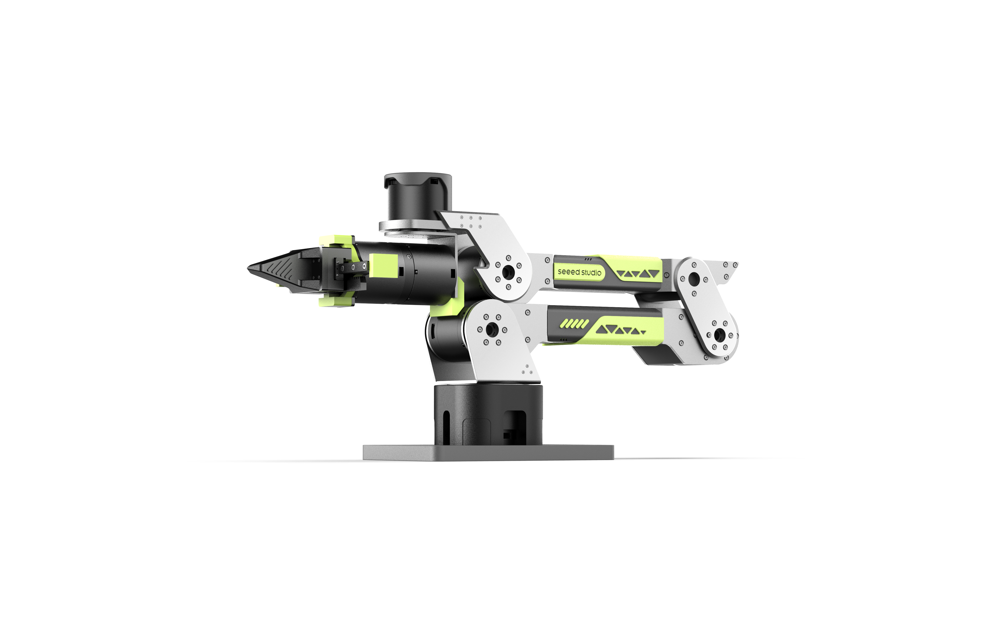
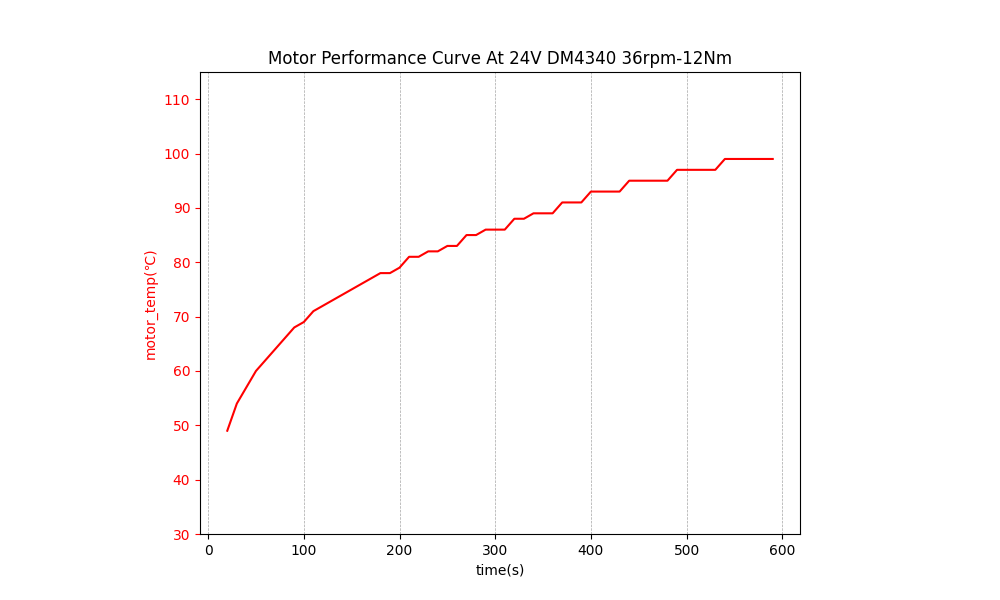

# 🧪 reBot-DevArm 実機性能テストリファレンス

  

  <strong>
    <a href="./Performance_Testing_zh.md">简体中文</a> &nbsp;|&nbsp;
    <a href="./Performance_Testing.md">English</a> &nbsp;|&nbsp;
    <a href="./Performance_Testing_JP.md">日本語</a>&nbsp;|&nbsp;
    <a href="./Performance_Testing_Fr.md">français</a>&nbsp;|&nbsp;
    <a href="./Performance_Testing_es.md">Español</a>
  </strong>

> [!NOTE]
> このドキュメントは、通常および極限の作業条件における reBot Arm B601-DM の性能テストデータリファレンスを提供します。

> [!WARNING]
> **バージョン差異のお知らせ**: このテストは、**Damiao V4 バージョンモーター**を搭載した reBot Arm B601-DM に基づいています。**V3 およびそれ以前のモーターバージョンは性能が異なります**。テストデータは参考用であり、実際の性能は実測为准としてください。

---

## 💡 クイックサマリー

**テスト終了理由**: すべてのテストは、**2 番モーター（大臂関節）の過熱保護**により終了しました。機械構造の故障ではありません。

**動的動作テスト**（単一動作時間 5 秒基準、往復動作）:

| リーチ範囲 | 負荷 | 持続時間 | 終了理由 |
|----------|------|----------|----------|
| 5%~70% 定格リーチ | 1.5 kg | > 2 h | 2 番モーター温度 90℃到達 |
| 5%~70% 定格リーチ | 2.5 kg | 40 min | 2 番モーター過熱保護 |
| 5%~100% 定格リーチ | 1.5 kg | 45 min | 2 番モーター過熱保護 |

**静的保持テスト**:

| リーチ位置 | 負荷 | 持続時間 | 終了理由 |
|----------|------|----------|----------|
| 70% 定格リーチ | 1.5 kg | 18 min | 2 番モーター過熱保護 |
| 100% 定格リーチ | 1.5 kg | 3 min | 2 番モーター過熱保護 |

> 👉 **主要結論**: マニピュレータの構造強度は十分です。テスト終了の理由は**2 番モーターの過熱保護**です。推奨作業負荷は**1.5 kg 以下**、作業リーチは**70% 未満**を推奨し、アクティブ冷却措置の追加を推奨します。

---

## 📋 目次

- [⚡ 極限作業性能テスト](#-極限作業性能テスト)
- [📈 公式負荷曲線](#-公式負荷曲線)
- [📝 テスト結論と推奨事項](#-テスト結論と推奨事項)
- [🙋 よくある質問 (FAQ)](#-よくある質問-faq)
- [📅 更新履歴](#-更新履歴)
- [📞 テクニカルサポート](#-テクニカルサポート)

---

## ⚡ 極限作業性能テスト

### テスト条件

**動的動作テスト**:
- 単一動作時間：5 秒
- 動作モード：往復動作
- テストリーチ範囲：5%~70% / 5%~100% 定格リーチ

**静的保持テスト**:
- テスト姿勢：静止姿勢負荷保持
- テストリーチ：70% / 100% 定格リーチ

### テスト結果

#### 1. 動的動作テスト

| テスト位置 | 負荷 (kg) | 最大持続時間 | 終了理由 |
|----------|-----------|--------------|----------|
| リーチ 5%~70% | 1.5 | > 2 h | 2 番モーター過熱保護 |
| リーチ 5%~70% | 2.5 | 40 min | 2 番モーター過熱保護 |
| リーチ 5%~100% | 1.5 | 45 min | 2 番モーター過熱保護 |

#### 2. 静的保持テスト

| テスト位置 | 負荷 (kg) | 最大持続時間 | 終了理由 |
|----------|-----------|--------------|----------|
| リーチ 70% | 1.5 | 18 min | 2 番モーター過熱保護 |
| リーチ 100% | 1.5 | 3 min | 2 番モーター過熱保護 |

---

## 📈 公式負荷曲線

Damiao 43 シリーズモーター 12Nm バージョン負荷曲線

---

## 📝 テスト結論と推奨事項

### 使用推奨事項

1. **推奨作業条件**
   - 負荷：< 1.5 kg
   - 作業半径：< 70% リーチ（450 mm）
   - 動作速度：< 70% 最大速度
   - 環境温度：15 °C ~ 35 °C

2. **冷却推奨事項**
   - 長時間高負荷作業時は、アクティブ冷却の追加を推奨
   - 2 時間の連続作業後、10~15 分の休憩を推奨
   - 直射日光や密閉空間での使用を避けてください

---

## 🙋 よくある質問 (FAQ)

<b>Q1: 高温環境下ではマニピュレータの性能は低下しますか？</b>

はい。環境温度が 35 °C を超えるか、モーター温度が 75 °C を超える場合、精度と寿命を確保するために負荷と動作速度を低下させることを推奨します。高温下での継続的な使用は推奨しません。

<b>Q2: テストデータはすべてのバージョンに適用されますか？</b>

このテストは、**Damiao V4 バージョンモーター**を搭載した reBot Arm B601-DM に基づいています。**V3 およびそれ以前のモーターバージョンは性能が異なります**。テストデータは参考用です。

---

## 📅 更新履歴

| バージョン | 日付 | 更新内容 | 作成者 |
|------|------|----------|------|
| v1.0 | 2026.04.01 | 初期バージョン、基本性能テストデータ公開 | SeeedStudio AI Robotics Team |

---

## 📞 テクニカルサポート

性能テストに関するご質問がありましたら、お気軽にお問い合わせください：

- **テクニカルサポート**: yaohui.zhu@seeed.cc
- **Discord**: [コミュニティに参加](https://discord.gg/AbGuqJhDpQ)
- **Wiki**: [ナレッジベースを表示](https://wiki.seeedstudio.com/robotics_page/)

---

  <strong>🤖 reBot-DevArm - すべての開発者のためのオープンソースマニピュレータ</strong>

